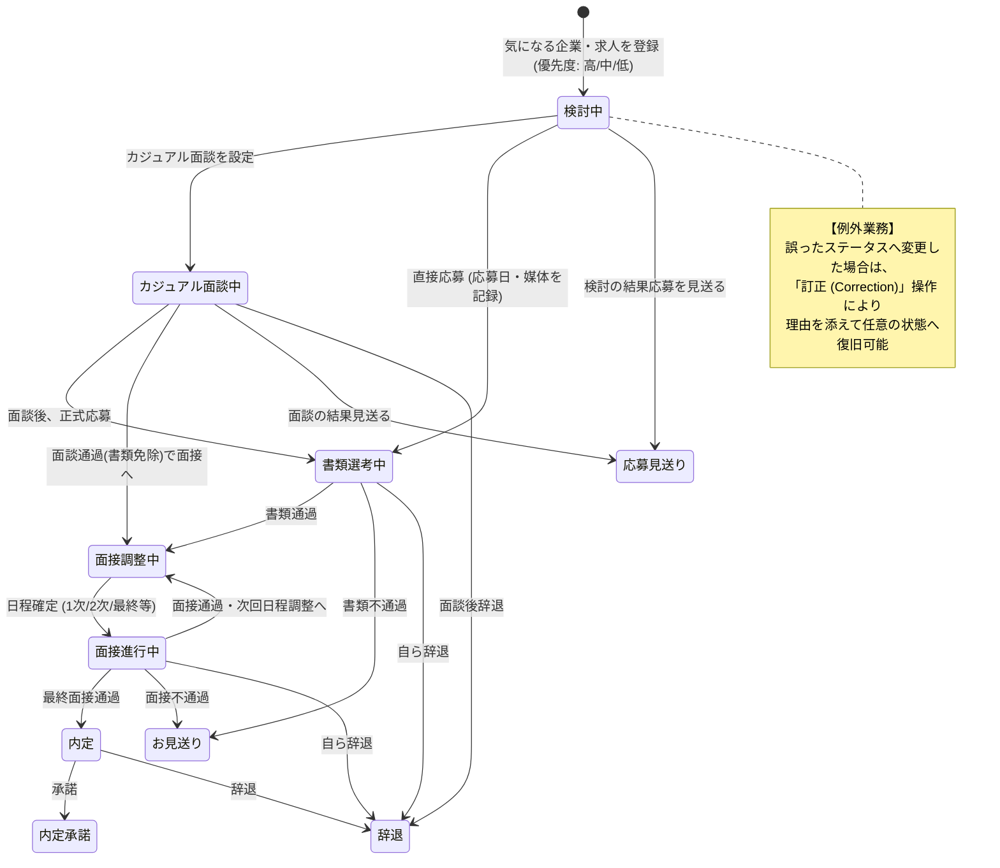

# 01. 要件定義書 (Requirements Specification)

## 1. システム概要 & 開発背景

### 1.1 背景と課題
エンジニアの転職活動において、求人媒体（各転職サービス、各社採用ページ、エージェント紹介など）が多岐にわたるため、以下の課題が頻発する。
1. **情報散乱**: 「どの媒体から、どのポジションに応募したか」「気になる求人のURLや想定年収」がスプレッドシートや各種メッセージに散らばる。
2. **優先度管理の欠如**: 応募前の「気になる企業リスト」の中で優先順位（志望度）が曖昧になり、応募スケジュール管理が後手に回る。
3. **選考プロセスの可視化不足**: 複数社の面接日程、選考フェーズ、面接で話した内容（逆質問や振り返り）のログが一元管理できない。
4. **ヒューマンエラー**: ステータス更新時の誤操作（誤ってお見送りにしてしまった等）に対する復旧や履歴追跡がしにくい。

### 1.2 本システムの目的
求人媒体に依存せず、**応募前の下調べ・優先順位づけから、選考プロセスの進行、面接ごとの振り返り、結果までをUser-scoped（完全プライベート）に一元管理するトラッカーWebアプリケーション**を提供する。

---

## 2. ターゲットペルソナ & 想定利用シーン

- **ペルソナ**: 転職を目指すソフトウェアエンジニア。
- **利用シーン**:
  - **フェーズ1（応募前）**: 日常的に求人情報を見つけた際、とりあえず企業名・求人URL・気になるポイントをメモし、志望度（優先度）を設定しておく。
  - **フェーズ2（応募時）**: 志望度が高い企業から順に応募を実行。応募日と応募媒体を記録し、ステータスを「書類選考中」へ遷移させる。
  - **フェーズ3（選考中）**: 面接が決まったら日程・形式（オンライン/対面）・担当者・想定質問メモを登録。面接終了後は「振り返り」を即座に記録する。
  - **フェーズ4（結果・管理）**: 内定/辞退/お見送りのステータスを確定。万が一ステータスを誤操作した場合は「訂正理由」を添えて直前の状態に戻す。

---

## 3. 業務フロー & 状態遷移概要

---

## 4. 機能要件 (MVP vs Phase 2)

### 4.1 MVP対象機能 (In-Scope)

| カテゴリ | 機能名 | 詳細要件 |
| :--- | :--- | :--- |
| **認証・認可** | ユーザー登録・ログイン | ・Laravel Sanctumを用いたSPA Cookie認証 ・パスワードハッシュ化、ログアウト |
| **マルチテナント** | データ完全隔離 | ・全ての企業・応募データはログインユーザー（`user_id`）に完全に紐づく ・他ユーザーのデータはAPIレベルでアクセス不可（403/404） |
| **企業管理** | 企業登録・一覧・詳細 | ・企業名、企業URL、業界/事業概要（自由メモ） |
| **求人・応募管理** | 応募前検討 (Interested) | ・ポジション名、求人URL、想定年収/待遇メモ ・優先度（高 / 中 / 低）の設定 ・下調べ・志望動機などの自由記入メモ |
| | 応募ステータス管理 | ・「検討中」から「応募済み（書類選考）」への遷移 ・選考ステップの進行（書類 → 1次面接 → ... → 内定/お見送り/辞退） |
| | ステータス誤入力訂正 | ・通常の進行操作とは分離された「ステータス訂正」機能 ・訂正理由（例: 操作ミス、連絡行き違い等）の入力と変更ログの記録 |
| **面談・面接管理** | 選考ステップ記録 | ・ステップ種別（カジュアル面談, 1次面接, 2次面接, 最終面接 等） ・日時、形式（オンラインURL / 対面住所） ・面接官情報、事前準備メモ、事後振り返りメモ |

### 4.2 Phase 2以降の対象機能 (Out-of-Scope)

以下の機能はMVPの早期リリースとテスタビリティ重視のため、意図的にPhase 2へ見送る。
- 開発言語・フレームワーク・職種ごとのタグ分類・集計
- 選考通過率や選考リードタイムの分析ダッシュボード
- 求人媒体マスタ管理（MVPではフリーテキスト/Enumで対応）
- カレンダー連携（Google Calendar API等）
- NativePHP によるデスクトップアプリ化（MVP完成後の移植ターゲット）

---

## 5. 非機能要件

1. **セキュリティ**:
   - SPA認証における CSRF 対策（Laravel Sanctum XSRF-TOKEN）。
   - httpOnly Cookie によるセッション保護。
   - Mass Assignment 脆弱性対策（FormRequest による厳格なバリデーション）。
   - 認可漏れ対策（Laravel Gate / Policy を適用）。
2. **保守性 & テスタビリティ**:
   - ドメインロジック（状態遷移、不変条件）は Eloquent モデルから疎結合にし、単体テスト（PHPUnit / Pest）で網羅。
   - バックエンド API に対する Feature テストの実装。
3. **ユーザビリティ (UI/UX)**:
   - レスポンシブデザイン（PC・スマートフォン両対応）。
   - 応募前リストと選考中リストの直感的な切り替え（タブまたはカンバン風リスト表示）。
