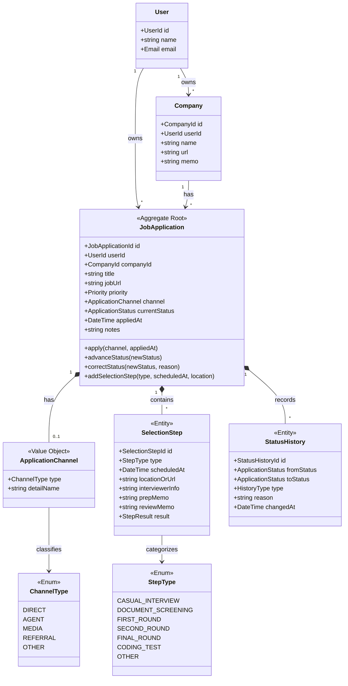

# 02. ドメインモデル設計 (Domain Model & Ubiquitous Language)

## 1. ユビキタス言語辞書 (Ubiquitous Language)

言葉の定義のズレを防ぐため、業務で用いる用語とコード上の表現を定義する。

| 用語 (日本語) | 用語 (コード / 英語) | 種別 | 説明 |
| :--- | :--- | :--- | :--- |
| **ユーザー** | `User` | Entity (Tenant) | システムの利用者。完全なマルチテナント境界（データ隔離のオーナー）。 |
| **企業** | `Company` | Entity | 応募対象となる企業。ユーザーごとに独立して管理される。 |
| **求人応募 / 検討ポジション** | `JobApplication` | Aggregate Root | 応募または検討している求人・ポジション。本ドメインの**集約ルート**。 |
| **選考ステータス** | `ApplicationStatus` | Value Object / Enum | 検討中・選考中・結果などの状態を表す。不正な遷移をガードする。 |
| **優先度** | `Priority` | Value Object / Enum | 志望度・優先順位（`HIGH`: 高, `MEDIUM`: 中, `LOW`: 低）。 |
| **応募媒体** | `ApplicationChannel` | Value Object | 応募経路情報。大分類区分（`ChannelType`）と具体名（エージェント社名、サイト名等）を内包する。 |
| **媒体種別** | `ChannelType` | Value Object / Enum | 媒体の大分類（`DIRECT`: 直接応募, `AGENT`: エージェント, `MEDIA`: 転職サイト, `REFERRAL`: リファラル, `OTHER`: その他）。 |
| **選考ステップ** | `SelectionStep` | Entity | 具体的な1回ごとの面接・面談イベント（実体）。日時、担当面接官、振り返りメモ、合否結果を保持。 |
| **ステップ種別** | `StepType` | Value Object / Enum | 選考ステップの種類・区分（カジュアル面談、一次面接、二次面接、最終面接、課題選考など）。 |
| **ステータス履歴** | `StatusHistory` | Entity | ステータス変更の証跡。通常遷移と「訂正（Correction）」を識別する。 |

---

## 2. 集約の境界づけ (Aggregate Boundaries)

DDDにおいて、**データの整合性（不変条件）を保つ最小単位**が集約（Aggregate）である。

### 集約ルートの選定理由
- **`JobApplication` を集約ルートとする**:
  - 面接日程（`SelectionStep`）やステータス履歴（`StatusHistory`）は、求人応募が存在しなければ単体では意味を持たない。
  - 外部（ControllerやApplication Service）から `SelectionStep` を直接作成・変更させず、必ず `JobApplication` を介して操作させることで、**「お見送りになった応募に勝手に面接日程を追加できない」といった不変条件を1箇所で担保**できる。
- **`Company` を独立した集約とする**:
  - 1つの企業に対して「過去の応募」と「今回新規の検討ポジション」を紐づけるなど、企業情報と個々の応募のライフサイクルが異なるため分離する。

---

## 3. ステータス遷移ルールと不変条件 (Invariants)

選考ステータス（`ApplicationStatus`）の遷移は、業務ロジックの最重要部分であり、**TDDによる単体テストで網羅すべき対象**となる。

### 3.1 ステータス一覧 (Enum)

| 値 (Value) | 表示名 | フェーズ分類 | 説明 |
| :--- | :--- | :--- | :--- |
| `INTERESTED` | 検討中 | 応募前 | 気になる企業・ポジションをストックしている段階。 |
| `CASUAL_INTERVIEW` | カジュアル面談中 | 応募前/面談 | 正式応募前にカジュアル面談を実施・調整している段階。 |
| `DOCUMENT_SCREENING` | 書類選考中 | 選考中 | 正式に応募した状態。 |
| `INTERVIEW_ADJUSTING`| 面接日程調整中 | 選考中 | 面接に進むことが決まり、日程連絡待ち/調整中の状態。 |
| `INTERVIEW_IN_PROGRESS`| 面接進行中 | 選考中 | 1次〜最終面接などの日程が確定し、選考が進んでいる状態。 |
| `OFFERED` | 内定 | 最終結果 | 内定通知を受けた状態。 |
| `ACCEPTED` | 内定承諾 | 完了 | 転職先として承諾した状態（ゴール）。 |
| `REJECTED` | お見送り | 完了 | 企業側から不通過通知を受けた状態。 |
| `WITHDRAWN` | 辞退 | 完了 | 候補者側から選考を辞退した状態。 |
| `SKIPPED` | 検討見送り | 完了 | 応募前に検討した結果、応募を見送った状態。 |

---

### 3.2 順遷移マトリクス (Normal Transitions)

通常の業務フローで許可される遷移（`advanceStatus` / `transitionTo`）：

| 遷移元 (From) | 許可される遷移先 (To) | 備考 / ガード条件 |
| :--- | :--- | :--- |
| **`INTERESTED` (検討中)** | `CASUAL_INTERVIEW`, `DOCUMENT_SCREENING`, `SKIPPED` | 面談へ進むか、直接応募するか、検討を見送るか。 |
| **`CASUAL_INTERVIEW` (カジュアル面談中)** | `DOCUMENT_SCREENING`, `INTERVIEW_ADJUSTING`, `SKIPPED`, `WITHDRAWN` | 面談後に正式応募するか、選考免除で面接へ進むか、見送るか。 |
| **`DOCUMENT_SCREENING` (書類選考中)** | `INTERVIEW_ADJUSTING`, `REJECTED`, `WITHDRAWN` | 書類選考結果による分岐。応募媒体・応募日が必須。 |
| **`INTERVIEW_ADJUSTING` (面接調整中)**| `INTERVIEW_IN_PROGRESS`, `REJECTED`, `WITHDRAWN` | 日程確定で進行中へ。 |
| **`INTERVIEW_IN_PROGRESS` (面接進行中)**| `INTERVIEW_ADJUSTING`, `OFFERED`, `REJECTED`, `WITHDRAWN` | 次の面接へ進む場合は調整中へ戻る。最終面接通過で内定へ。 |
| **`OFFERED` (内定)** | `ACCEPTED`, `WITHDRAWN` | 承諾か辞退を選択。 |
| **`ACCEPTED` / `REJECTED` / `WITHDRAWN` / `SKIPPED`** | (なし) | 完了ステータス。これ以上の順遷移は不可。 |

---

### 3.3 例外対応：ステータス訂正 (Status Correction)

「誤って操作した」「先方の連絡ミスで差し戻された」などの例外業務に対する設計。

- **操作メソッド**: `correctStatus(ApplicationStatus $newStatus, string $reason)`
- **ルール**:
  - 任意のステータスへの変更を許可する（例: `REJECTED` から `INTERVIEW_IN_PROGRESS` への復帰）。
  - ただし、**「訂正理由 (`reason`)」の入力（1文字以上）を必須**とする。
  - `StatusHistory` に `HistoryType::CORRECTION` として理由と共に永続化される。

---

## 4. ビジネスルール・不変条件のまとめ (TDDテスト対象)

ドメイン層で死守すべき不変条件（Invariants）：

1. **マルチテナント不変条件**:
   - `JobApplication` に `SelectionStep` を追加する際、同一の `userId` を持つコンテキストでなければならない。
2. **選考ステップ追加のガード**:
   - ステータスが `INTERESTED`（検討中）または完了系（`ACCEPTED`, `REJECTED`, `WITHDRAWN`, `SKIPPED`）の場合、新たな `SelectionStep` は追加できない（ドメイン例外 `CannotAddStepException` をスロー）。
   - `CASUAL_INTERVIEW`（カジュアル面談中）ステータス時は、`StepType::CASUAL_INTERVIEW` のステップのみ追加可能。
   - `INTERVIEW_ADJUSTING` / `INTERVIEW_IN_PROGRESS` ステータス時は、面接・試験系のステップ（`FIRST_ROUND`, `FINAL_ROUND` など）を追加可能。
3. **応募完了時の整合性**:
   - `DOCUMENT_SCREENING`（書類選考）へ遷移する際、応募日（`appliedAt`）および応募媒体（`channel`）が未設定であってはならない（ドメイン例外 `IncompleteApplicationException` をスロー）。
4. **訂正ログの完全性**:
   - 訂正操作時は必ず理由（`reason`）が記録され、履歴の改ざんは不可。

