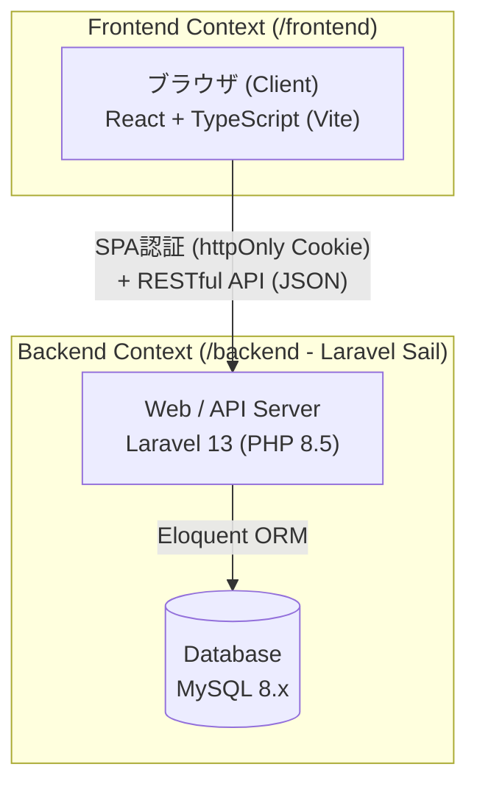
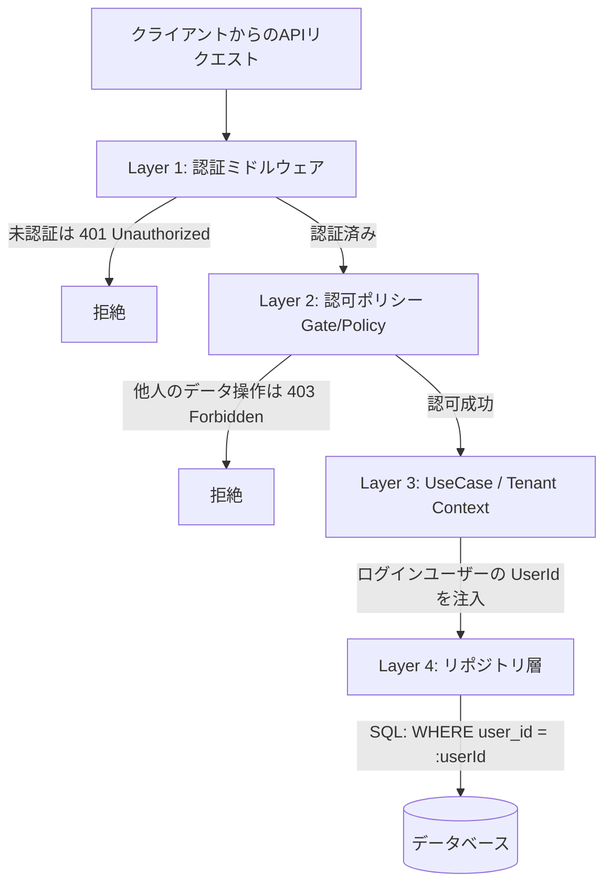
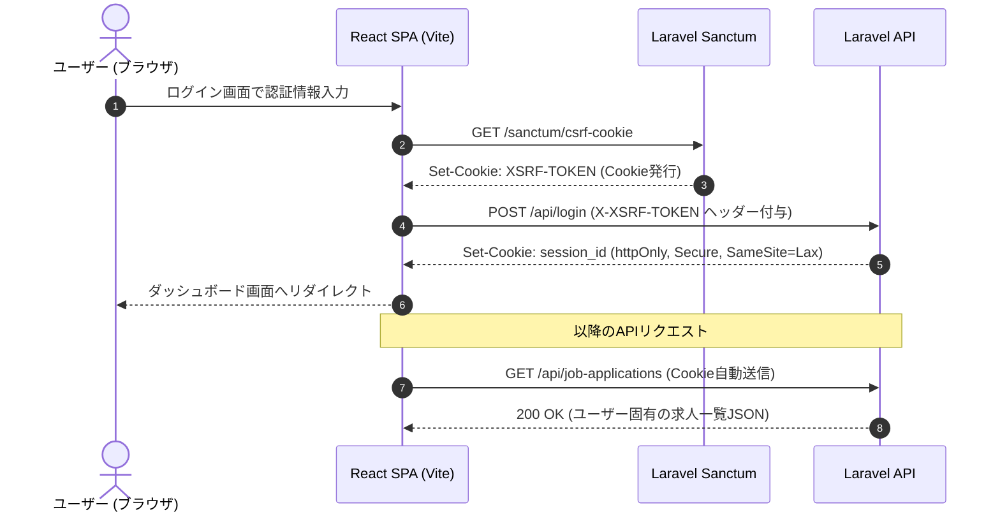

# 03. アーキテクチャ設計書 (Architecture Design)

## 1. システム全体構成 & 技術スタック

本システムは、バックエンドに **Laravel 13 (PHP 8.5)**、フロントエンドに **React (TypeScript + Vite)** を採用した、疎結合なSPA（Single Page Application）+ RESTful API 構成をとる。



---

## 2. 軽量DDD（Lightweight DDD）レイヤー設計方針

### 2.1 採用の背景と目的
Laravel標準のActiveRecord（Eloquent）は高速な開発を可能にする一方、ビジネスロジックがControllerやEloquentモデルに散乱し、**Fat Controller / Fat Model による保守性低下とテスタビリティの喪失**を引き起こしやすい。
本プロジェクトでは、Laravelのエコシステム（DI、Validation、Resource、Policy）の利便性を享受しつつ、**ドメインロジック（状態遷移・不変条件）をDBから完全に切り離してTDDで検証可能にする「軽量DDD」**を採用する。

### 2.2 レイヤー構造と責務

```mermaid
graph TB
    subgraph Presentation ["1. プレゼンテーション層 (Presentation Layer)"]
        Controller["Controller<br>(HTTPリクエストハンドリング)"]
        FormRequest["FormRequest<br>(入力バリデーション)"]
        Resource["JsonResource<br>(APIレスポンス変換)"]
    end

    subgraph Application ["2. アプリケーション層 (Application Layer)"]
        UseCase["UseCase / Application Service<br>(業務ユースケースの調整・トランザクション制御)"]
        DTO["Data Transfer Object (DTO)<br>(レイヤー間の型安全なデータ受け渡し)"]
    end

    subgraph Domain ["3. ドメイン層 (Domain Layer - 純粋PHP)"]
        Entity["Domain Entity / Aggregate Root<br>(JobApplication, SelectionStep)"]
        VO["Value Object / Enum<br>(ApplicationStatus, ApplicationChannel, Priority)"]
        DomainException["Domain Exception<br>(ビジネスルール違反の例外)"]
        RepoInterface["Repository Interface<br>(データアクセスの抽象)"]
    end

    subgraph Infrastructure ["4. インフラストラクチャ層 (Infrastructure Layer)"]
        EloquentModel["Eloquent Model<br>(DBテーブルとの1対1マッピング)"]
        RepoImpl["Repository Implementation<br>(Eloquentを用いた永続化・ドメイン相互変換)"]
    end

    Controller --> FormRequest
    Controller --> UseCase
    Controller --> Resource
    UseCase --> DTO
    UseCase --> Entity
    UseCase --> RepoInterface
    RepoImpl ..|> RepoInterface
    RepoImpl --> EloquentModel
    RepoImpl --> Entity
```

### 2.3 各レイヤーの責務とルール

| レイヤー | 主要クラス | 責務とルール |
| :--- | :--- | :--- |
| **Presentation** | `*Controller`<br>`*Request`<br>`*Resource` | ・HTTPリクエストの受付、入力バリデーション（`FormRequest`）。<br>・UseCaseの呼び出しと、結果をJSON（`JsonResource`）へ変換。<br>・**ビジネスロジックは一切書かない**。 |
| **Application** | `*UseCase`<br>`*Dto` | ・1ユースケース＝1クラス（例: `ApplyJobUseCase`, `AdvanceStatusUseCase`）。<br>・DBトランザクション（`DB::transaction`）の管理。<br>・リポジトリからドメインエンティティを取得し、メソッドを呼んで永続化するオーケストレーション。<br>・**ドメインルールそのものは記述しない**。 |
| **Domain** | `*` (Entity)<br>`*Status` (Enum)<br>`*RepositoryInterface` | ・**フレームワーク非依存の純粋なPHPクラス**。<br>・ビジネスルール、不変条件（Invariants）、状態遷移をメソッドとしてカプセル化。<br>・DB接続なしで単体テスト（PHPUnit / Pest）が高速実行可能。 |
| **Infrastructure** | `Eloquent*`<br>`*Repository` | ・`RepositoryInterface` の実装クラス。<br>・Eloquentモデルを用いてDBと通信し、Eloquentモデル ↔ ドメインエンティティの相互マッピングを行う。 |

---

## 3. Eloquentとドメインモデルの共存戦略（相互マッピング）

LaravelでのDDDにおいて最大の議論点となるのが「Eloquentモデルをそのままドメインエンティティにするか、分けるか」である。

- **採用方針: ドメインエンティティとEloquentモデルの完全分離（相互マッピング）**
  - ドメインエンティティ（例: `App\Domain\JobApplication\JobApplication`）は純粋なPHPクラスとする。
  - Eloquentモデル（例: `App\Infrastructure\Persistence\Eloquent\JobApplicationModel`）は単なるテーブルスキーマ・データ保持役とする。
  - リポジトリ（`JobApplicationRepository`）内で相互変換（`toDomain()` / `toEloquent()`）を行う。
  
- **メリット**:
  - テスト時にモックやDBを起動する必要がなく、`$application = new JobApplication(...)` で高速にビジネスルールをTDD可能。
  - Eloquentの `save()` やマジックプロパティによるドメイン不変条件の破壊（意図しない更新）を100%防止できる。

---

## 4. マルチテナント設計（User-scoped データ隔離の多重防御）

本システムはマルチユーザー前提であり、**「他ユーザーのデータが誤って閲覧・更新されること」を絶対に防ぐ多重防御（Defense-in-Depth）** を設計する。



### 多重防御の4つの防壁
1. **Layer 1: 認証（Sanctum Middleware）**
   - 全ての業務APIは `auth:sanctum` ミドルウェアで保護し、非認証リクエストを弾く。
2. **Layer 2: 認可（Laravel Policy）**
   - 各リソース操作（Show, Update, Delete）の直前で Policy（例: `JobApplicationPolicy@update`）を実行し、`$user->id === $jobApplication->userId` を検証。
3. **Layer 3: テナントコンテキストの明示（UseCase引数）**
   - UseCaseの実行引数には、Controllerがセッションから取得した `UserId` を必ず渡す。
4. **Layer 4: クエリの強制スコープ（Repository層）**
   - リポジトリの検索・更新メソッドは必ず `userId` を検索条件に含める（例: `findByIdAndUserId(JobApplicationId $id, UserId $userId)`）。

---

## 5. 認証・セキュリティ設計 (Laravel Sanctum SPA Cookie)

APIトークン（Bearer Token）をフロントエンドのローカルストレージに保存する構成は、XSS（クロスサイトスクリプティング）攻撃によってトークンが窃取される脆弱性を持ちやすい。
そのため、本システムでは **Laravel Sanctum 公式推奨の「SPA認証（httpOnly Cookie + CSRF保護）」** を採用する。

### 認証シーケンス



- **httpOnly Cookie**: JavaScriptからCookie値を読み取れないため、XSSによるセッションハイジャックを防御。
- **XSRF-TOKEN**: ブラウザのSameSite属性およびLaravelのVerifyCsrfTokenにより、CSRF攻撃を防御。

---

---

## 6. テスト戦略 & TDD方針 (Pest PHP)

本プロジェクトのバックエンドテストには、モダンなPHPテスティングフレームワークである **Pest (`pestphp/pest`)** を採用する。

### 6.1 Pest採用理由
1. **表現力と可読性**: `it('cannot add selection step when status is interested')` のような自然言語に近い記法で、テストケースそのものが仕様書として機能する。
2. **高速なTDDサイクル**: ドメイン層はDB非接続のため、ミリ秒単位でユニットテストが完了し、Red-Green-Refactor のリズムを崩さない。
3. **アーキテクチャテスト (Arch Testing)**: レイヤー間の依存関係違反をテストコードで強制・監視できる。

### 6.2 テストピラミッドと責務

| テスト種別 | ディレクトリ | 対象と検証内容 | 実行速度 |
| :--- | :--- | :--- | :---: |
| **Unit Test** | `tests/Unit/Domain/` | ・ドメインエンティティ、値オブジェクトの不変条件<br>・ステータス遷移マトリクス、例外スローの完全検証<br>・**DB接続なし (Pure PHP)** | 爆速 (数ms) |
| **Feature Test** | `tests/Feature/Api/` | ・APIエンドポイントのHTTPレスポンス・ステータスコード<br>・FormRequestバリデーション、Sanctum認証、認可Policy<br>・リポジトリを通じたDB永続化・トランザクション | 高速 (SQLite/MySQL) |
| **Arch Test** | `tests/Feature/ArchTest.php` | ・「Domain層はInfrastructure層に依存してはならない」といった軽量DDDのレイヤー原則の自動検証 | 瞬時 |

#### アーキテクチャテスト（Arch Test）の例
```php
// ドメイン層の純粋性を担保するテスト
arch('Domain layer must not depend on Infrastructure or Laravel Models')
    ->expect('App\Domain')
    ->not->toUse([
        'App\Infrastructure',
        'Illuminate\Database\Eloquent\Model',
    ]);

// コントローラが直接リポジトリ実装に依存しないことを担保
arch('Controllers must only interact via UseCases')
    ->expect('App\Http\Controllers')
    ->not->toUse('App\Infrastructure');
```

---

## 7. ディレクトリ構造案（バックエンド・フロントエンド）

```text
job-tracker/
├── Makefile                    # ローカル開発起動スクリプト (make dev, make test 等)
├── docs/                       # 設計ドキュメント群
│   ├── 01_requirements.md
│   ├── 02_domain_model.md
│   ├── 03_architecture.md
│   ├── 04_api_design.md
│   ├── 05_screen_design.md
│   └── adr/
├── backend/                    # Laravel 13 (PHP 8.5)
│   ├── app/
│   │   ├── Domain/             # ドメイン層 (純粋PHP)
│   │   │   ├── User/
│   │   │   ├── Company/
│   │   │   └── JobApplication/
│   │   │       ├── JobApplication.php         # 集約ルート
│   │   │       ├── SelectionStep.php          # 子エンティティ
│   │   │       ├── ValueObjects/              # Status, Priority, Channel等
│   │   │       ├── Exceptions/                # ドメイン例外
│   │   │       └── JobApplicationRepositoryInterface.php
│   │   ├── Application/        # アプリケーション層 (UseCase)
│   │   │   └── UseCases/
│   │   │       └── JobApplication/
│   │   │           ├── CreateJobApplicationUseCase.php
│   │   │           ├── AdvanceStatusUseCase.php
│   │   │           └── CorrectStatusUseCase.php
│   │   ├── Infrastructure/     # インフラ層 (Eloquent / 外部サービス)
│   │   │   └── Persistence/
│   │   │       └── Eloquent/
│   │   │           ├── Models/                # Eloquentモデル
│   │   │           └── Repositories/          # リポジトリ実装
│   │   └── Http/               # プレゼンテーション層
│   │       ├── Controllers/    # APIコントローラ
│   │       ├── Requests/       # FormRequest
│   │       └── Resources/      # JsonResource
│   └── tests/                  # Pest テストコード
│       ├── Unit/               # ドメイン層の高速単体テスト (TDD)
│       ├── Feature/            # APIエンドポイント統合テスト
│       └── ArchTest.php        # DDDレイヤー原則のアーキテクチャテスト
└── frontend/                   # React + TypeScript (Vite)
    ├── src/
    │   ├── api/                # Axios / APIクライアント定義
    │   ├── components/         # 共通UIコンポーネント
    │   ├── features/           # 機能単位のコンポーネント・Hooks
    │   │   ├── applications/   # 応募管理・検討中リスト
    │   │   ├── interviews/     # 面接日程・ステップ管理
    │   │   └── auth/           # 認証画面
    │   ├── routes/             # ルーティング定義
    │   └── types/              # TypeScript型定義
    └── package.json
```

