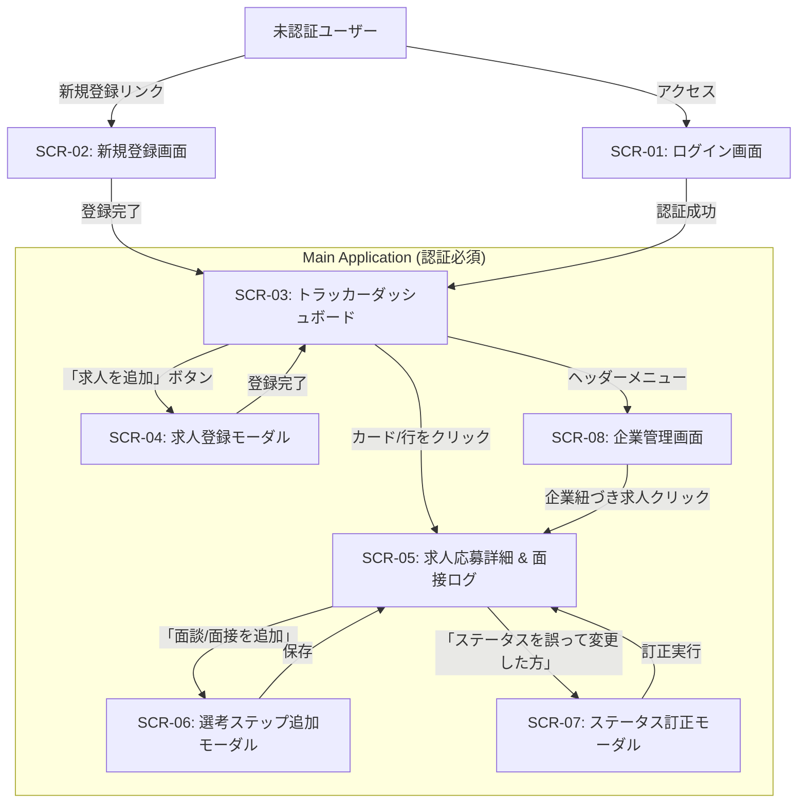

# 05. 画面設計書 (Screen Design & UI Specifications)

## 1. 画面一覧 (Screen List)

| 画面ID | 画面名 | パス (URL) | 概要 |
| :--- | :--- | :--- | :--- |
| **SCR-01** | ログイン画面 | `/login` | メールアドレス・パスワードによる認証 |
| **SCR-02** | 新規ユーザー登録画面 | `/register` | アカウント作成 |
| **SCR-03** | トラッカーダッシュボード (メイン) | `/` または `/applications` | 検討中リスト・選考中カンバン・完了アーカイブの統合ビュー |
| **SCR-04** | 求人登録・応募モーダル | (モーダル表示) | 検討中ストック、または直接応募の新規登録 |
| **SCR-05** | 求人応募詳細 & 面接ログ | `/applications/:id` | 応募詳細、選考タイムライン、面接メモ、ステータス進行/訂正 |
| **SCR-06** | 選考ステップ追加・編集モーダル | (モーダル表示) | カジュアル面談や1次〜最終面接の日程・振り返り登録 |
| **SCR-07** | ステータス訂正モーダル | (モーダル表示) | 誤操作時の理由付きステータス復帰 |
| **SCR-08** | 企業管理画面 | `/companies` | 企業一覧・登録・企業ごとの過去応募閲覧 |

---

## 2. 画面遷移図 (Screen Flow Diagram)



---

## 3. 主要画面のワイヤーフレーム & UI設計

### 3.1 SCR-03: トラッカーダッシュボード (メイン画面)
検討中（応募前）と選考中（応募後）の関心事をタブおよびカンバンで明確に切り替えて管理できる。

```text
+------------------------------------------------------------------------------------+
| Job Tracker                     [企業管理]               [田中 太郎 ▼] [ログアウト] |
+------------------------------------------------------------------------------------+
|  [ + 新しい求人・検討を追加 ]                                                       |
|                                                                                    |
|  [ タブ: 検討中 (5) ]  [ タブ: 選考中 (3) ]  [ タブ: 完了・結果 (8) ]               |
|                                                                                    |
|  絞り込み: [ 優先度: すべて ▼ ]  [ 媒体: すべて ▼ ]  検索: [ 企業名・職種...        ] |
+------------------------------------------------------------------------------------+
| 【タブ: 検討中 (Interested)】表示時                                                 |
|                                                                                    |
|  +--------------------+  +--------------------+  +--------------------+            |
|  | 株式会社AAA        |  | 株式会社BBB        |  | 株式会社CCC        |            |
|  | Webエンジニア      |  | フルスタック開発   |  | バックエンド(PHP)  |            |
|  | [ 優先度: 高 ★★★ ] |  | [ 優先度: 中 ★★☆ ] |  | [ 優先度: 低 ★☆☆ ] |            |
|  | 想定: 600-750万円  |  | 想定: 600万円前後  |  | 想定: 550-650万円  |            |
|  | 下調べメモ:        |  | 下調べメモ:        |  | 下調べメモ:        |            |
|  | DDD導入中で魅力    |  | リモート週4可      |  | 勉強会が活発       |            |
|  |                    |  |                    |  |                    |            |
|  | [カジュアル面談]   |  | [カジュアル面談]   |  | [カジュアル面談]   |            |
|  | [今すぐ応募する]   |  | [今すぐ応募する]   |  | [今すぐ応募する]   |            |
|  +--------------------+  +--------------------+  +--------------------+            |
+------------------------------------------------------------------------------------+
| 【タブ: 選考中】表示時: カンバンビュー (書類選考 / 面接調整 / 面接進行中)           |
+------------------------------------------------------------------------------------+
```

---

### 3.2 SCR-05: 求人応募詳細 & 面接ログ画面
1つの求人に対するすべての選考プロセス・メモ・ステータス操作が完結する、本アプリの中核画面。

```text
+------------------------------------------------------------------------------------+
| < ダッシュボードへ戻る                                                             |
|                                                                                    |
| 株式会社AAA                                                                        |
| バックエンドエンジニア (PHP/Laravel)             [ 優先度: 高 ★★★ ]                |
| 現在のステータス: [ 面接進行中 ] (次回: 2次面接 10/15)                             |
|                                                                                    |
| 求人URL: https://example.com/jobs/123 [開く ↗]   応募媒体: 転職メディア (直接応募) |
| 応募日: 2026-10-01                              想定年収: 600〜750万円             |
+------------------------------------------------------------------------------------+
| 【次のアクション / ステータス進行】                                                |
| [ 次の面接調整へ進む ]   [ 内定を獲得 ]   [ お見送り ]   [ 辞退する ]              |
|                                                                                    |
| ※誤ったステータスに変更してしまった場合は [こちらから訂正]                         |
+------------------------------------------------------------------------------------+
| 【選考プロセス・面接タイムライン】                      [ + 面談・面接日程を追加 ] |
|                                                                                    |
| ● 2次面接 (予定) - 2026/10/15 (木) 19:00〜                                        |
|   場所/URL: Google Meet (https://meet.google.com/xxx)                              |
|   担当者: 開発責任者・VPoE                                                         |
|   事前準備メモ: 技術的負債の解消方針とチームの開発生産性について質問する           |
|                                                                                    |
| ● 1次面接 (通過) - 2026/10/08 (木) 20:00〜                                        |
|   担当者: バックエンドテックリード                                                 |
|   振り返り: DDDの適用範囲やテストの書き方で盛り上がった。手応えあり。              |
|                                                                                    |
| ● カジュアル面談 (完了) - 2026/10/02 (金) 19:30〜                                  |
|   振り返り: 開発組織の雰囲気が非常に良く、応募を決意。                             |
+------------------------------------------------------------------------------------+
| 【総合メモ・企業研究】                                              [ 編集する ]   |
| ・アーキテクチャはLaravel+React。現在マイクロサービスからモジュラーモノリスへ移行中 |
+------------------------------------------------------------------------------------+
```

### 3.3 SCR-04: 求人登録・応募モーダル
「気になる求人を見つけた時」に即座にストック、または直接応募を登録できるモーダル。企業のインライン新規登録にも対応し、入力の手間を最小化する。

```text
+-----------------------------------------------------------------+
| 新しい求人・検討を追加                                       [X] |
+-----------------------------------------------------------------+
| 企業名 (必須):                                                  |
| [ 株式会社サンプル                                      ]       |
| ※既存企業から選択、または新しい企業名を入力してその場で作成     |
|                                                                 |
| 募集ポジション・求人タイトル (必須):                            |
| [ バックエンドエンジニア (PHP/Laravel)                         ] |
|                                                                 |
| 求人URL:                                                        |
| [ https://example.com/jobs/123                                ] |
|                                                                 |
| 優先度 (志望度):                                                |
| ( ) 高 ★★★    ( ) 中 ★★☆    ( ) 低 ★☆☆                         |
|                                                                 |
| 登録種別:                                                       |
| ( ) まずは検討中リストに保存する (INTERESTED)                   |
| ( ) すでに応募済み / 直接応募する (DOCUMENT_SCREENING)          |
|                                                                 |
| [▼ 応募済みの場合は以下を入力]                                   |
|   応募媒体: [ 転職メディア ▼ ]  媒体詳細名: [ サービス名      ] |
|   応募日:   [ 2026-10-01   ]                                    |
|                                                                 |
| 下調べメモ・志望理由:                                           |
| +-------------------------------------------------------------+ |
| | DDD導入中で技術スタックがマッチ。カジュアル面談希望。       | |
| +-------------------------------------------------------------+ |
|                                                                 |
|                        [ キャンセル ]   [ この内容で追加する ]  |
+-----------------------------------------------------------------+
```

---

### 3.4 SCR-07: ステータス訂正モーダル (例外復旧)
現場のヒューマンエラーを防ぎ、ドメインモデルの不変条件（理由の記録）を満たすUI。

```text
+-----------------------------------------------------------------+
| ステータスの訂正 (例外復旧)                                   [X] |
+-----------------------------------------------------------------+
| 現在のステータス: [ お見送り (REJECTED) ]                       |
|                                                                 |
| 変更後のステータス:                                             |
| [ 面接進行中 (INTERVIEW_IN_PROGRESS)                ▼ ]         |
|                                                                 |
| 訂正理由 (必須):                                                |
| +-------------------------------------------------------------+ |
| | 操作ミスでお見送りを押してしまったため、2次面接進行中に復旧 | |
| +-------------------------------------------------------------+ |
|                                                                 |
| ※ステータスの訂正履歴は監査ログとして記録されます。             |
|                                                                 |
|                        [ キャンセル ]   [ 理由を記録して訂正 ]  |
+-----------------------------------------------------------------+
```

---

### 3.5 SCR-08: 企業管理画面 (企業一覧・編集・削除・過去応募履歴)
企業情報のマスタメンテナンス拠点。企業情報の編集・削除や、その企業に過去紐づいた応募履歴を確認できる。

```text
+------------------------------------------------------------------------------------+
| Job Tracker                     [企業管理]               [田中 太郎 ▼] [ログアウト] |
+------------------------------------------------------------------------------------+
| < ダッシュボードへ戻る                                                             |
|                                                                                    |
| 企業管理                                                     [ + 企業を新規登録 ]   |
| 検索: [ 企業名で絞り込み...     ]                                                  |
+------------------------------------------------------------------------------------+
| 企業一覧                                                                           |
|                                                                                    |
| 株式会社AAA                                           [ 編集 ] [ 削除 ]            |
| URL: https://aaa-inc.example.com                                                   |
| メモ: 自社SaaS開発。DDD導入に積極的。開発組織約30名。                              |
| 応募履歴 (2件):                                                                    |
|   ・バックエンドエンジニア (PHP) - [ 面接進行中 ] (2026/10/01 応募)                 |
|   ・SREポジション (過去の応募)   - [ 辞退 ]       (2025/03/10 応募)                 |
| ---------------------------------------------------------------------------------- |
| 株式会社BBB                                           [ 編集 ] [ 削除 ]            |
| URL: https://bbb.example.com                                                       |
| メモ: フルリモートワーク可。モダンフロントエンド推進中。                           |
| 応募履歴 (1件):                                                                    |
|   ・フルスタックエンジニア       - [ 検討中 ]     (2026/10/03 追加)                 |
+------------------------------------------------------------------------------------+
```

---

## 4. UI/UX設計原則 & フロントエンド実装方針

1. **認知的負荷の低減**:
   - 応募前の「気になる（Interested）」と応募後の「選考中」は目的が異なるため、タブで明確に視界を分ける。
   - 重要なアクション（次の選考へ進む）は強調ボタン、破壊的操作（お見送り・辞退）はセカンダリスタイルで誤クリックを防止。
2. **状態変化の即時フィードバック**:
   - 面接ステップ追加やステータス変更時は、トースト通知（Toast）で成功/失敗を明示。
   - APIエラー時は「なぜその操作ができないか（例: 検討中ステータスには面接日程を追加できません）」を親切なメッセージで表示。
3. **レスポンシブデザイン**:
   - PCではカンバン・2カラムレイアウトで情報量を確保。
   - スマートフォン（モバイルブラウザ）では縦スクロールのカード型リストで快適に閲覧・メモ入力可能。
