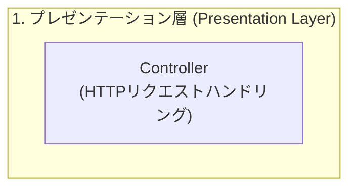

# Phase 1: ドメイン層の実装と TDD (Learning Log)

本ドキュメントは、Phase 1（ドメインモデル・値オブジェクト・集約ルートの実装）において得られた言語仕様・テストフレームワークの挙動、および設計判断の記録である。

---

## 1. Pest の `with()` データプロバイダと `DatasetMissing` の正体

### 事象
テストコード内で `with([ '検討中 -> ...' => [ApplicationStatus::INTERESTED, ... ] ])` を定義して実行した際、`Pest\Exceptions\DatasetMissing`（引数が2つあるのにデータセットが渡されていない）というエラーが発生した。

### 原因と技術的背景
1. **Pest のテスト登録ライフサイクル**:
   - Pest はテストを実行する前段階（ファイルパース時）で `with([...])` の配列を即時評価し、テストランナーにデータセットを登録しようとする。
2. **PHPのクラス定数評価タイミング**:
   - 配列内に `ApplicationStatus::INTERESTED` と書かれていたが、この時点で `ApplicationStatus` クラス（Enum）自体がファイルとして未作成であった。
3. **エラーの連鎖**:
   - PHPが未定義のクラス定数を解決できず、データセットの抽出処理が途中で中断。その結果、Pestが「引数（`$from`, `$to`）のみが存在し、データセットが空である」と判定して `DatasetMissing` を出力した。

### 得られた知見（TDDのプラクティス）
- TDDの「Red（テスト失敗）」を美しく成立させるためには、**テストファイルが安全に構文解釈されるための「中身が空のクラス・Enum（箱）」を先に配置する必要がある**。
- 箱がある状態で初めて、「メソッド未定義（`Call to undefined method`）」という**本来のロジック起因の Red** を迎えることができる。

---

## 2. PHP 8 `match` 式の構文特性（文と式の違い）

### 事象
`ApplicationStatus::canTransitionTo()` の実装時、`match ($this) { ... }` の末尾にセミコロン `;` を忘れたことで、PHPの構文エラー（`Parse error: syntax error, unexpected token "}", expecting ";"`）が発生した。

### 原因と技術的背景
PHPにおいて、従来の `switch` と PHP 8 で導入された `match` は根本的に文法上の分類が異なる。

| 構文 | 文法分類 | 戻り値 | 末尾セミコロン | 特徴 |
| :--- | :--- | :---: | :---: | :--- |
| **`switch`** | **文 (Statement)** | なし | 不要 | 制御構文。ブロック自体が値を返さないため、波括弧の後にセミコロンは置かない。緩やかな比較（`==`）。 |
| **`match`** | **式 (Expression)** | **あり** | **必須 (`;`)** | 単一の値を評価して返す「式」。`return 1 + 1;` と同様に、代入やreturnの対象となるため、末尾に `;` が必要。厳格な比較（`===`）。 |

```php
// 誤り (Parse Error)
return match ($this) {
    self::INTERESTED => true,
    default => false,
} // ← セミコロンがない

// 正しい記述
return match ($this) {
    self::INTERESTED => true,
    default => false,
}; // ← match式全体の終わりを示すセミコロンが必須
```

### 得られた知見
- `match` 式はコードを劇的に簡潔かつ型安全（厳格比較 `===`）にする強力な機能だが、**「式（Expression）であるため文末の `;` が必須」** という文法ルールを徹底する。

---

## 3. SPL標準 `DomainException` を継承する設計的根拠

### 背景
ステータスの不正遷移時にスローする独自例外 `InvalidStatusTransitionException` を作成するにあたり、基底クラスとして PHP 標準の `DomainException` を採用した。

### 設計的根拠
PHPの標準例外（SPL: Standard PHP Library）の階層構造：

```text
\Throwable
 └── \Exception
      ├── \LogicException (プログラムのロジック上の誤り。コード修正で防ぐべきもの)
      │    ├── \DomainException (★ここを採用)
      │    ├── \InvalidArgumentException
      │    └── \OutOfRangeException
      └── \RuntimeException (実行時にしか検知できない環境的要因等)
```

- PHP公式マニュアル定義:
  > **DomainException**: 「値が定義された有効なデータドメインに一致しない場合にスローされる例外」
- DDD（ドメイン駆動設計）において、「ドメインの不変条件（ビジネスルール）を破る操作が行われたこと」を表現する例外として、言語仕様上最も整合性が高い。

---

## 4. PHPStan Level 8 による厳格な品質担保

### 背景
開発初期から `larastan/larastan` を導入し、設定最高峰の **`level: 8`** を適用した。

### 初回解析での学び
- 初期状態の解析で、Pestのサンプル関数 `something()` に対して `missingType.return`（戻り値型の未指定）が検出された。
- Level 8 では、通常の業務コードだけでなく、テストコードやヘルパー関数であっても **「引数型・戻り値型の完全指定」** が強制される。
- これを初期からパスさせ続けることで、ドメインモデル全体の型安全性が強固に保証される。

---

## 5. 緩やかな比較 (Loose Comparison `!=` / `==`) の排除と PHPStan の型推論

### 事象
`ApplicationChannel` のコンストラクタで、文字列トリム後の空文字判定に `!= null && != ''` を使用した際、PHPStan Level 8 から `Loose comparison using != between non-empty-string and '' will always evaluate to true. (notEqual.alwaysTrue)` という指摘を受けた。

### 原因と技術的背景
PHPにおいて、`==` や `!=`（緩やかな比較）は暗黙の型変換を伴う。
- 例えば、文字列 `"0"` はブール変換で `false` 扱いになり、数値比較や空文字比較で予期せぬ挙動を引き起こす「型ジャグリング（Type Juggling）」の温床となる。
- PHPStan は変数の型を `?string` から「null ではない文字列（`non-empty-string` または `string`）」へと型絞り込み（Type Narrowing）を行っている最中に、緩やかな比較が混ざると論理的な矛盾や潜在的バグとして検知する。

### 解決策とベストプラクティス
- 暗黙の型変換に頼らず、常に **厳格な比較（`!==` / `===`）** を使用する。
- または、null チェックと空文字チェックを明確なガード節（`if-else`）に分離し、PHPStan にコードの意図を明示的に伝える。

---

## 6. PHP 8.4+ 非対称可視性 (`public private(set)`) によるカプセル化

### 背景
エンティティ `SelectionStep` のプロパティ（`$result`, `$reviewMemo` 等）を `public` にすると、外部から `$step->result = ...` と直接代入され、`recordReview()` のバリデーション（トリム処理等）を経由せずに改ざんされる危険性（カプセル化の破綻）があった。

### 従来の課題（PHP 8.3 以前）
カプセル化を守るためには、プロパティを `private` にした上で、参照用のゲッター（`public function getResult(): StepResult`）を大量に定義する必要があり、コードがボイラープレートで肥大化していた。

### PHP 8.4+ での解決
PHP 8.4 で導入された **非対称可視性（Asymmetric Visibility: `public private(set)`）** を採用。

```php
public private(set) ?string $reviewMemo = null,
public private(set) StepResult $result = StepResult::PENDING,
```

- **読み取り（Read）**: 外部から `$step->result` とシンプルかつ直感的に直接参照可能（ゲッター不要）。
- **書き込み（Write）**: 外部からの代入（`$step->result = ...`）は **PHPコンパイラ（言語エンジン）が構文エラーとして弾く**。
- 変更は必ずクラス内の振る舞いメソッド（`recordReview()` 等）を経由することが強制され、**ボイラープレートゼロで完全なカプセル化** を実現できた。

---

## 7. Pest データセット (`with()`) における引数マッピング仕様と `DatasetArgumentsMismatch`

### 現象
Pest の `with()` を使ったパラメタライズドテストで、テスト関数側が2つの引数を期待しているにもかかわらず以下のエラーが発生した。

```text
FAILED Tests\Unit\Domain\JobApplication\ApplicationStatusTest > it returns correct label for each status
DatasetArgumentsMismatch: Test expects 2 arguments but dataset only provides 1
```

### 原因
データセットを以下のように連想配列で定義していた：

```php
it('returns correct label for each status', function (ApplicationStatus $status, string $expectedLabel) {
    expect($status->getLabel())->toBe($expectedLabel);
})->with([
    ApplicationStatus::INTERESTED->getLabel() => '検討中',
    ...
]);
```

Pest において、**連想配列の「キー」はテスト結果のレポートに表示されるテスト名（ラベル）** として扱われ、**テスト関数の引数には「値」のみが渡される**。
上記の場合、値は `'検討中'` という単一の文字列であるため、テスト関数の第1引数に文字列が渡され、第2引数が不足して引数不一致エラーとなった。

### 解決策
テスト関数が複数の引数を受け取る場合は、各データ要素を **タプル（配列）** の形式で渡す必要がある。
名前付きデータセットにする場合も、値側を配列にする。

```php
it('returns correct label for each status', function (ApplicationStatus $status, string $expectedLabel) {
    expect($status->getLabel())->toBe($expectedLabel);
})->with([
    '検討中'         => [ApplicationStatus::INTERESTED, '検討中'],
    'カジュアル面談中' => [ApplicationStatus::CASUAL_INTERVIEW, 'カジュアル面談中'],
    ...
]);
```

---

## 8. GitHub Mermaid パーサーにおける特殊記号（括弧）のエスケープ規則

### 現象
GitHub の Markdown プレビュー画面で Mermaid ダイアグラムが `Parse error` となり、描画に失敗した。

```text
Unable to render rich display
Parse error on line 2:
...tion [1. プレゼンテーション層 (Presentation Layer)
-----------------------^
Expecting 'SQE'..., got 'PS'
```

### 原因
Mermaid の `subgraph ID [表示名]` 構文において、表示名の中に半角括弧 `(` や `)` を含めると、GitHub の構文解析器が括弧をノード定義（丸角ノードや円ノード等）の記法と誤認してしまう（`PS` = Parenthesis Start / 括弧開始）。

### 解決策
特殊文字（括弧や記号）を含むラベルは、必ず角括弧の内側をダブルクォーテーションでクォートする（`subgraph ID ["表示名 (詳細)"]`）。




